# Autó Navigátor

## **Követelményanalízis**
-----------------------

A beadandó célja egy kis webes alkalmazás elkészítése szerveroldali technológiák segítségével. A feladatnak minimálisan tartalmaznia kell:

- az órai munkától jelentősen el kell térnie
- legalább négy modellt, legyen bennük egy-sok és sok-sok kapcsolatban álló reláció is.
- legalább három tábla adatait szerkeszteni kell tudni: lista, új, módosít, töröl (vagy inaktívvá tesz)
- legyenek benne csak hitelesítés után elérhető funkciók (autentikáció)
- ügyelni kell, hogy csak a megfelelő adatokhoz férjen hozzá a megfelelő felhasználó (autorizáció)

## Funkcionális követelmények
 - Vendégként a főoldalon szeretnék autókat látni kategóriánként.
 - Vendégként szeretnék az autók között szabadon böngészni.
 - Vendégként szeretnék egy autóleírást megtekinteni.
 - Vendégként szeretnék autót keresni.
 - Vendégként szeretnék tudni regisztrálni az oldalra.
 
 - Felhasználóként szeretnék tudni bejelentkezni az oldalra.
 - Felhasználóként szeretném tudni a profiladataimat szerkeszteni.
 - Felhasználóként szeretnék az autók leírásához hozzászólni és értékelni azokat.
 
## Nem funkcionális követelmények 
 - Felhasználóbarát, ergonomikus elrendezés és kinézet.
 - Gyors működés.
 - Biztonságos működés: jelszavak tárolása, funkciókhoz való hozzáférés.  

## Használatieset-modell

Az alkalmazásban a felhasználóknak személygépjárművek adatainak a megtekintésére van lehetőségük. Az oldal használatához registrációra nincs szükség. Azonban regisztráció estén lehetőség van új gépjármű felvételére – márka, típus, évjárat, motor és kategória mezők kötelező megadásával. Az autók kategóriákba sorolhatóak, így meg lehet jeleníteni a csak egy kategóriába tartozó autókat. Csak az adminnank van jogosltsága gépjerművek törlésére.

## Szerepkörök
- vendég: Az a felhasználó, aki azonosítatlanul használja az alkalmazást. A weben a legtöbb látogató ilyen. A vendég felhasználó csak a publikus oldalakat és funkciókat érheti el. Ilyenek a főoldal, a rólunk és az autós listák, a bemutató oldal, valamint a bejelentkezés és regisztráció.
- bejelentkezett, azonosított felhasználó: a bejelentkezett felhasználók a publikus oldalakon kívül az autókhoz véleményt írhatnak és értékelhetik azokat, továbbá.
- adminisztrátor: a felhasználói adatokat módosítani képes felhasználó, új autókat tud hozzáadni, módosítani és meglévőket törölni.

## Tervezés:

### Végpontok

 - GET /: főoldal
 - GET /login: bejelentkező oldal
 - POST /login: bejelentkezési adatok felküldése
 - GET /profile: profiladatok
 - GET /autok: autólista
 - GET /autok/id: autó megtekintése
 - GET /autok/create: új autó felvitele, űrlap megjelenítése
 - POST /autok/create: új autók felvitele, adatok küldése
 - GET /films/edit: autók szerkesztése, űrlap megjelenítése
 - POST /films/edit: autók szerkesztése,  adatok küldése
 - POST /films/delete: autók törlése, adatok küldése
 
### Oldalvázlat
#### Főoldal:

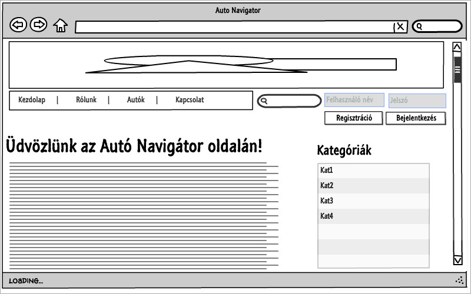

#### Autentikáció után elért oldal:

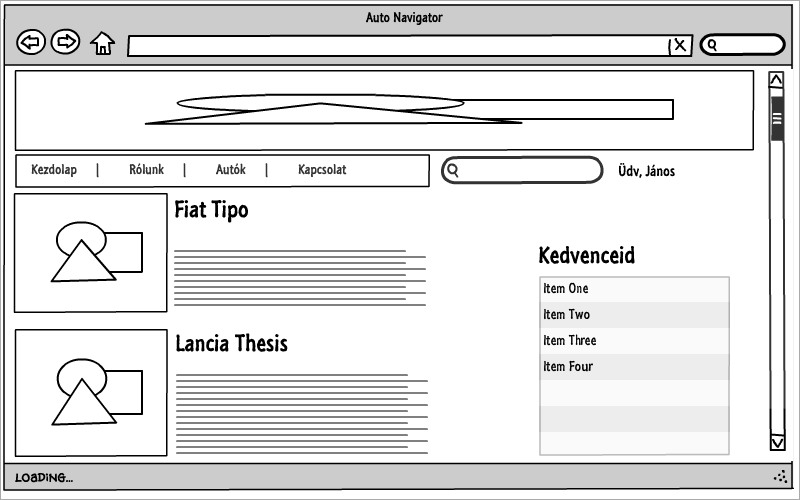

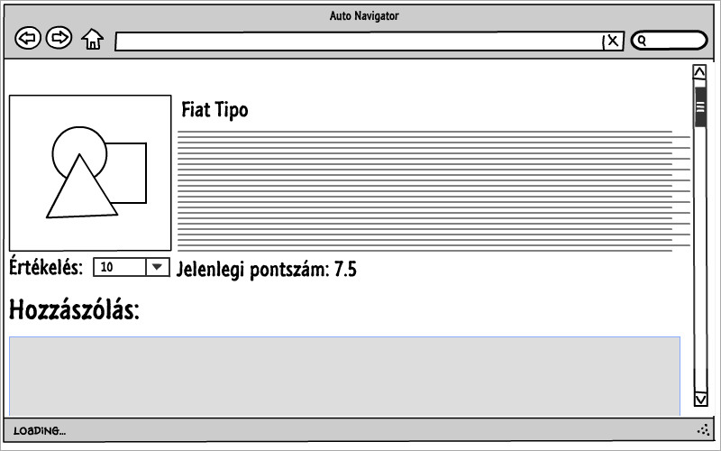

#### Vendégként megtekintett oldal:

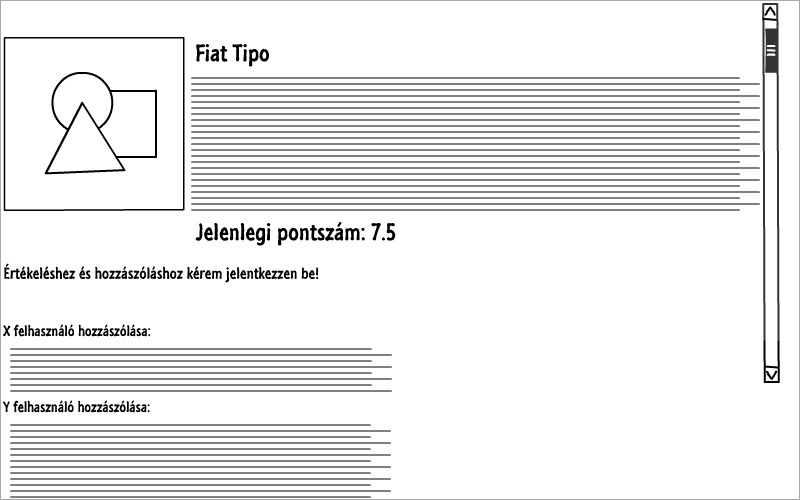

### Szekvencia diagram

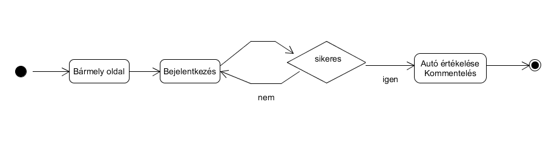

### Adatmodell
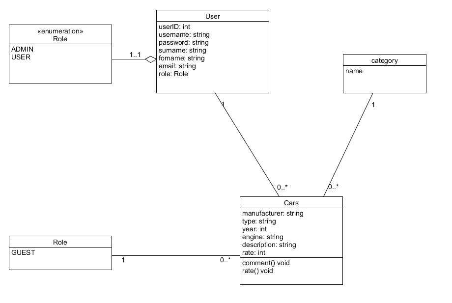

### Szerepkörtől független UseCase diagram
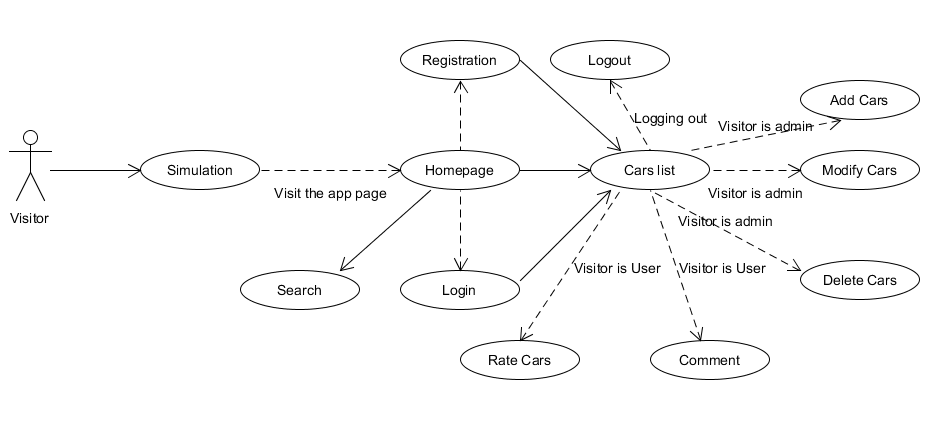

### Megjelenés

**Főoldal bejelentkezés nélkül**

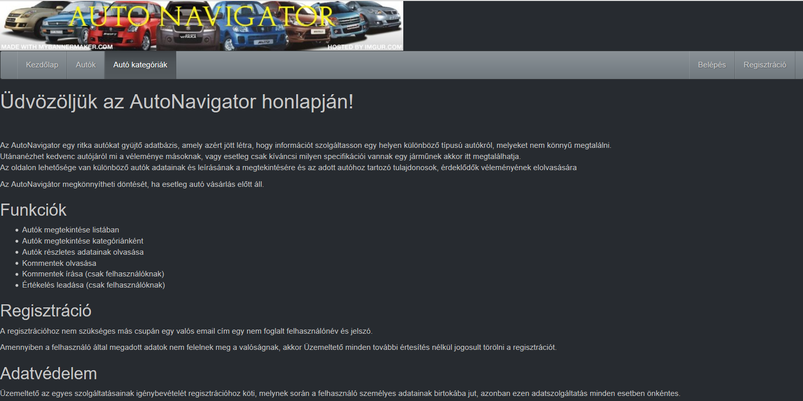

**Autók listában**

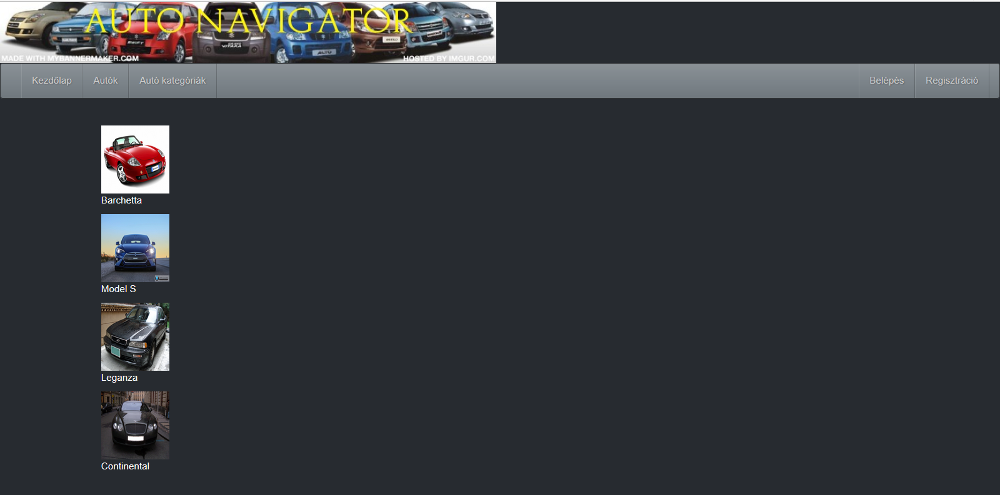

**Komment írás**

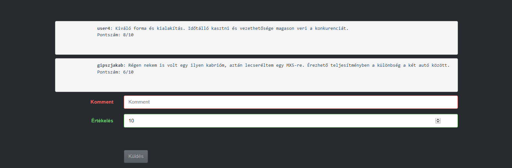

**Regisztráció**

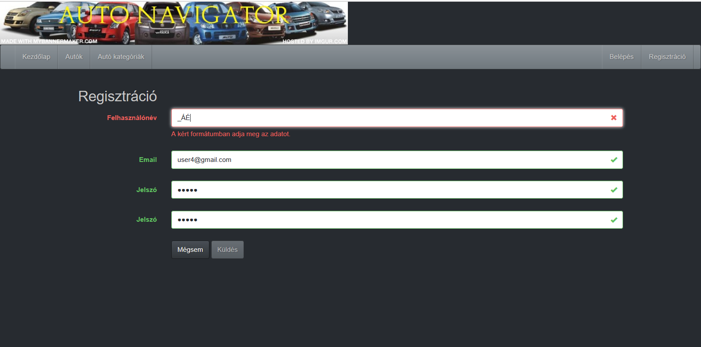

**Autók kategóriák szerint**

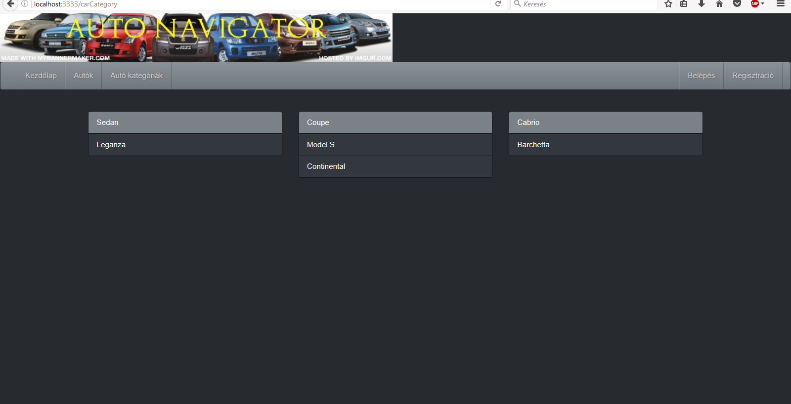

**Bejelentkezés jelszó nélkül**

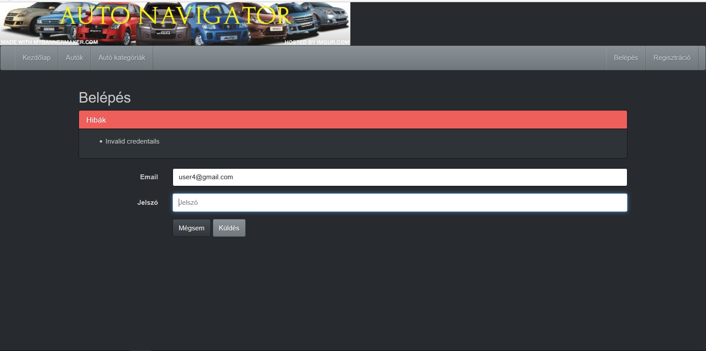

**Kijelentkezés**

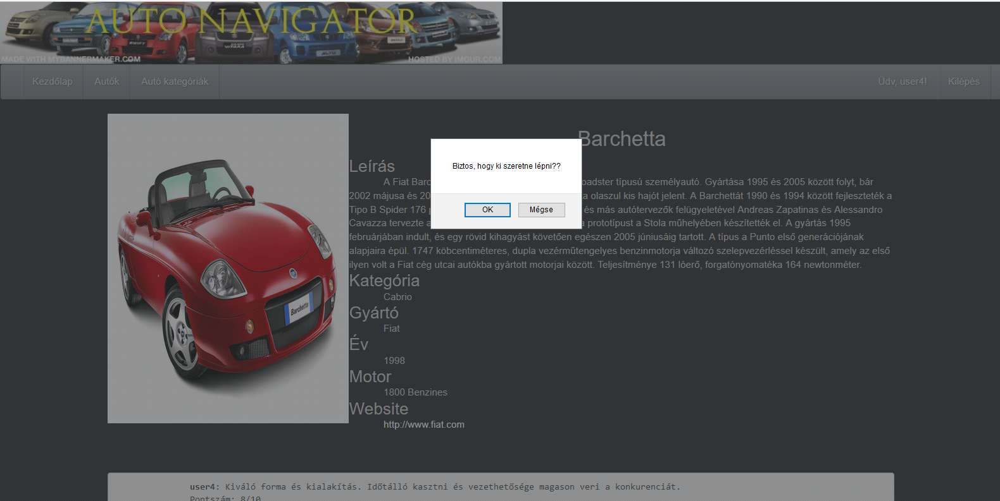

## Implementáció

 **Fejlesztő környezet: Visual Studio Code (node.js - adonis.js keretrendszer)**
  * Futtatás: terminál ablak nyitása (ctrl + ö) -> cd cars -> npm start
  * Használat: bármely böngészőben indítható a localhost:3333-on

## Kliensoldali funkciók

** Popup Login**
 - Módosított / új fájlok: *login_popup.js*, *main.njk*, *login.njk*, *UserController.js*, *routes.js*
 - Leírás: A főoldalon, ha nem vagyunk bejelentkezve, akkor egy  hívás történik mely során felugrik egy AJAX-os ablak, ahol be lehet jelentkezni (így nem kell a bejelentkező oldalra ugrani)
 
 
 **Szekvencia diagram:**  
 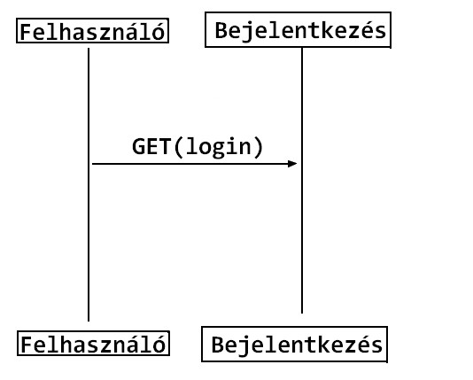

**Regisztrációs adatok validálása**  
 - Módosított / új fájlok: *register.njk*
 - Leírás: Regisztráció során ellenőrzi, hogy a felhasználó megfelelő adatokat adott-e meg:  
  * Felhasználónév: csak ékezet nélküli betű és szám
  * Email: email formátumnak megfelelő
  * Jelszó: a két jelszónek meg kell egyeznie
  
**Kiléps megerősítés**
 - Leírás: Egy már belépett felhasználó véletlen kijelentkezését, szükséges megakadályozni. Egy egyszerű popupon keresztül megerősítendő a kijelentkezés szándéka
 
**Komment validálás**
 - Leírás: Egy már belépett felhasználó kommentelésének a feltételeit ellenőrzi, melyek szerint értékelést csak szöveges komment mellett, és szöveges kommentet csak értékelés mellett, küldhet el a bejelentkezett felhasználó.

## Könyvtárszerkezet
 
  **A fejlesztés szempontjából lényeges könyvtárak, fájlok:**

![] (file.PNG)

### Felhasználói dokumentáció

**Használathoz szükséges:**
- tetszőleges operációs rendszer
- böngésző (Chrome, Firefox, stb...)
- Visual Studio Code

**Használat rövid leírása:**
- bejelentkezés/regisztráció
- kommentek olvasása
- autók listázása
- autók értékelése
- kommentek írása

**Tesztek:**
 - a kommentelést teszteli, bejelentkezett felhasználó esetén
 - kezdőlapról történő bejelentkezés és kijelentkezést tesztel
 - kezdőlapról regisztrációt tesztel
 - kijelentkezett felhasználó esetén autók listázását és komment olvasást tesztel

**Selenium IDE telepítése**

 > A **Selenium IDE** használatához szükségünk lesz egy *FireFox*ra.  
 > Letöltés: https://www.mozilla.org/hu/firefox/new/  
 > Ha sikeresen telepítettük, akkor kiegészítőként letölthetjük hozzá a **Selenium IDE**-t.  
 > Letöltés: https://addons.mozilla.org/hu/firefox/addon/selenium-ide/  
 
**Selenium IDE használata**
 > --Telepítés után a Ctrl+Alt+S kombminációval indíthatjuk el az IDE-t a Firefox böngészőben. Ha elindítottuk az alkalmazást, akkor a zöld nyíllal futtathatjuk a teszteket. A tesztek a test alkönyvtárban találhatóak.
 
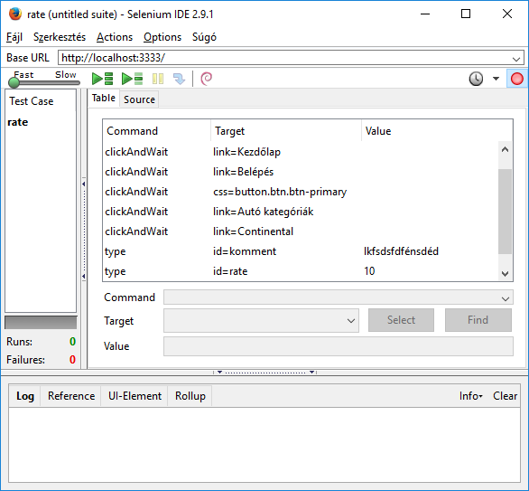

